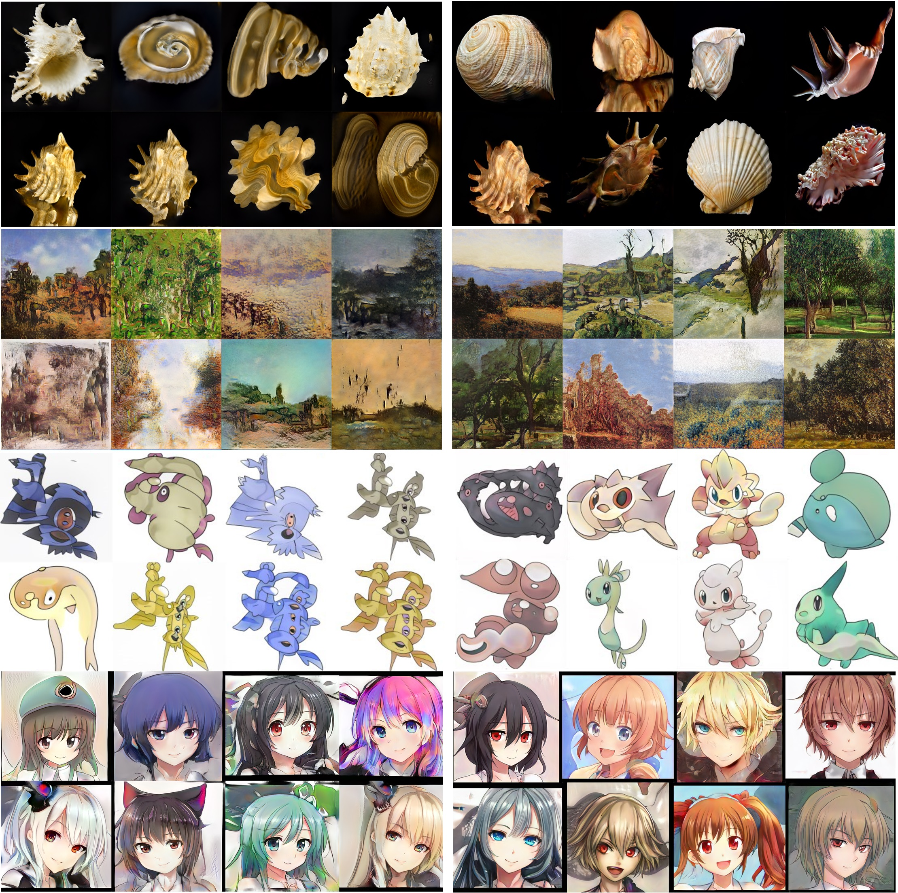

# Adaptive-Feature-Interpolation-for-Low-Shot-Image-Generation (ECCV 2022)

Paper: [https://arxiv.org/abs/2106.10777](https://arxiv.org/abs/2112.02450)

Below are generated images trained on datasets with 60-1000 samples:
<p align="center">

</p>
<p align="center">
(Left: StyleGAN2-ADA; Right: + Adaptive Feature Interpolation)
</p>

# Usage:
Please refer to interp_feature.py for direct use, or StyleGAN2 implementation in the corresponding folder.  

# Citation
```
@misc{https://doi.org/10.48550/arxiv.2112.02450,
  doi = {10.48550/ARXIV.2112.02450},
  url = {https://arxiv.org/abs/2112.02450},  
  author = {Dai, Mengyu and Hang, Haibin and Guo, Xiaoyang},
  title = {Adaptive Feature Interpolation for Low-Shot Image Generation},
  publisher = {arXiv},
  year = {2021}, 
  copyright = {Creative Commons Attribution 4.0 International}
}
```
